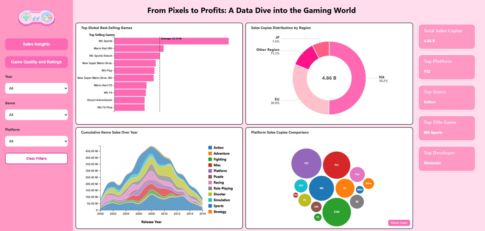
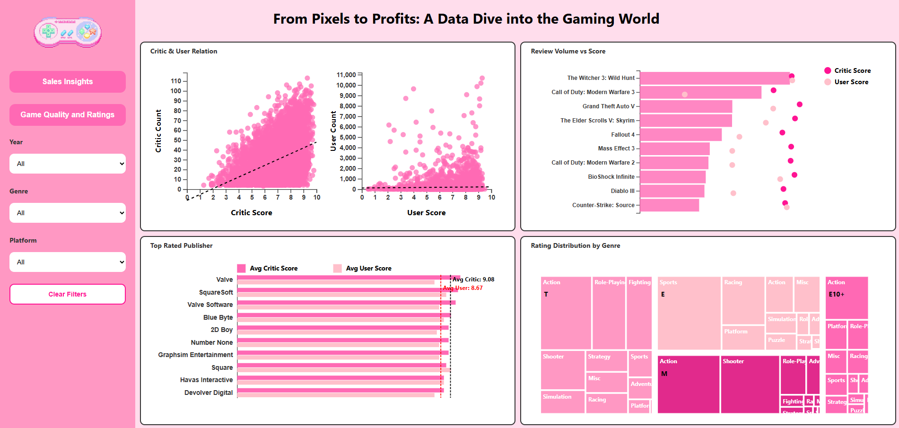

# 🎮 From Pixels to Profits: A Data Dive into the Gaming World

This interactive D3.js dashboard explores the evolution of the video game industry through two key lenses:
1. **Sales Insights**
2. **Game Quality & Ratings**

The project analyzes game sales, regional performance, critical acclaim, and user preferences using interactive, filterable visualizations.

---

## 📊 Dashboard Overview

### Page 1: **Sales Insights**

**Key Features:**
- **Top Global Best-Selling Games**: Horizontal bar chart of top-selling titles (e.g., Wii Sports, Mario Kart).
- **Sales by Region**: Donut chart showing sales split across NA, EU, JP, and Other regions.
- **Cumulative Genre Sales Over Time**: Area chart revealing genre trends from 2000–2016.
- **Platform Sales Comparison**: Bubble chart comparing total units sold by platform (e.g., PS2, Wii, Xbox 360).
- **Sidebar Insights**: Highlights the top-selling game, platform, genre, and developer based on sales data.

---

### Page 2: **Game Quality & Ratings**

**Key Features:**
- **Critic vs User Score Scatterplots**: Two visualizations comparing review count vs scores.
- **Review Volume vs Score**: Bar and dot chart comparing critic vs user sentiment for top games.
- **Top Rated Publishers**: Bar chart showing publishers with the highest average critic/user scores.
- **Rating Distribution by Genre**: Treemap of ESRB ratings (E, T, M, etc.) by genre.

---

## 🧠 Key Insights Explored

- Which platforms and genres sold the most games globally?
- Do user ratings align with critic reviews?
- Which publishers consistently deliver high-quality games?
- What’s the ESRB rating breakdown across popular genres?

---
